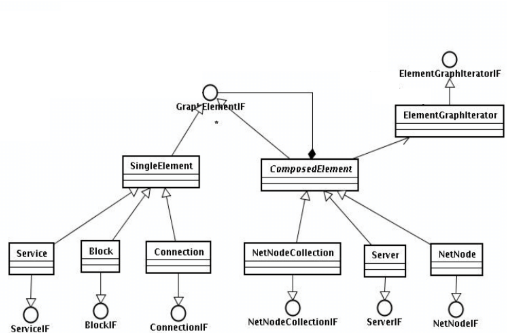

O diagrama de classes abaixo projeto um sistema de gerenciamento de elementos de redes que utiliza o padrão de projeto Composite que pode ser utilizado para obter informações dos elemenntos para exibí-los em interfaces de interaração (por exemplo, um Mapa). Escreva um código-fonte em qualquer linguagem de programação O.O que ilustre o uso dessas estruturas e explique as vantagens de utilizar o padrão de projeto.

**Resposta**

O padrão de projeto Composite é como ter uma caixa de ferramentas para lidar com objetos individuais e grupos de objetos de forma mais simples e consistente. Ele traz algumas vantagens para o nosso código:

Organização e facilidade de uso: O Composite permite que trabalhemos com objetos individuais e grupos de objetos da mesma maneira, como se todos fossem "objetos". Isso torna o código mais fácil de entender e usar, porque não precisamos fazer distinções complicadas entre diferentes tipos de objetos. Podemos tratar uma caixa de produtos e um produto individual da mesma maneira, mesmo que eles tenham comportamentos diferentes.

Criação de estruturas complexas: Com o Composite, podemos criar hierarquias de objetos, onde objetos compostos podem conter outros objetos, sejam eles individuais ou compostos. Isso é útil quando queremos construir estruturas complexas, como uma caixa de produtos que contém outras caixas, criando uma árvore de objetos. Essa capacidade de criar estruturas hierárquicas nos ajuda a organizar e gerenciar nossos objetos de forma mais eficiente.

Flexibilidade na manipulação de estruturas: O Composite facilita a adição, remoção e manipulação de objetos em estruturas complexas. Podemos adicionar ou remover objetos individualmente ou em grupos, sem precisar nos preocupar com detalhes complicados de como a estrutura está organizada internamente. Isso nos dá a liberdade de modificar e expandir nossas estruturas de forma mais simples e flexível.

Reutilização de código: Uma grande vantagem do Composite é que ele nos permite reutilizar o código existente. Podemos usar os mesmos componentes (objetos individuais e compostos) em diferentes contextos, construindo várias estruturas hierárquicas com facilidade. Isso economiza tempo e esforço, pois não precisamos reescrever ou duplicar código para criar diferentes hierarquias de objetos.

Operações abrangentes: Com o Composite, podemos realizar operações em toda a estrutura hierárquica de objetos de forma transparente. Por exemplo, no código fornecido, podemos calcular o preço total de todos os produtos, independentemente de estarem em objetos individuais ou grupos compostos. Essa capacidade de executar operações em toda a estrutura nos ajuda a realizar tarefas complexas de forma mais eficiente e elegante.